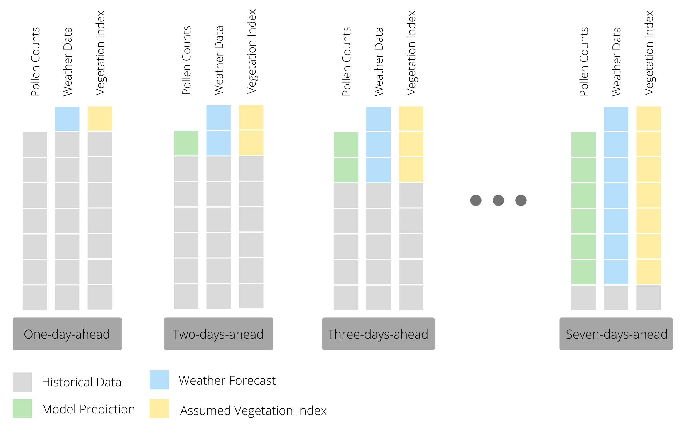
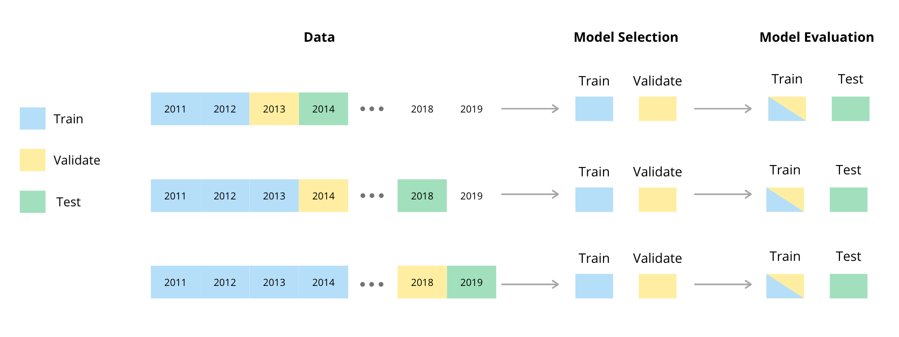
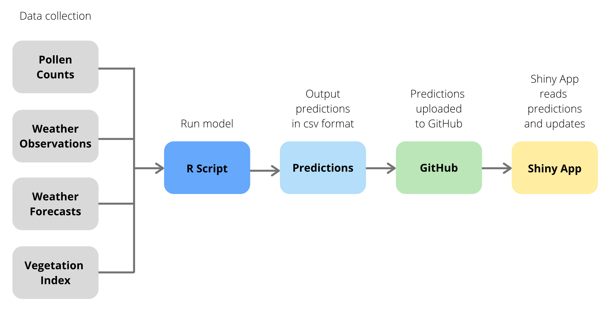

# Grass Pollen Forecasting
This is the repository used to make the project titled *Grass Pollen in Cape Town: A Comparison of Generalised Additive Models and Random Forests* by Sky Cope and Chloë Stipinovich. The final papaer can be found under the [documents folder](documents/CPXSKY001_STPCHL002_Honours_Project_2020.pdf).

## Synopsis

Reliable and accessible pollen forecasts can help allergy sufferers, enabling them to appropriately plan their outdoor activities. In this paper we used generalised additive models (GAMs) and random forests to build seven day ahead grass pollen forecast models, using pollen count data collected at the South African Astronomical Observatory (SAAO) by researchers at the UCT Lung Institute. Variables used to predict pollen levels were primarily meteorological, but also included a vegetation index variable. To make our forecast easier to interpret, our models output probability distributions over five categories of pollen levels, from Very Low to Very High. Further, we created a [Shiny app](https://chloesky.shinyapps.io/pollen/) for potentially displaying the results of our forecast on a website. 

## Method

### Recursive Forecasting

In order to predict pollen concentrations one to seven days ahead, we used a recursive forecasting strategy. This means that we built models to predict one day ahead pollen concentrations and then use that prediction for forecasting the next day’s pollen count.  In other words, we have one model that we reuse as we predict further and further out, iteratively replacing observed pollen counts with predicted ones and observed values of weather variables with forecasted ones as seen in thr figure below.



### The Need for Categories


### Testing and Validation




## Shiny App and Semi-Automated Workflow

We originally aimed to make the weekly pollen forecasts available on The [Real Pollen Count website](https://pollencount.co.za/). The UCT Lung Institute would have control of the forecast. This means that the forecast would need to be updated on a weekly basis, and it must not require extensive RStudio knowledge on the part of the user. In an ideal world the process would be fully automated: the user would simply need to upload the past week's pollen counts and a workflow would perform the necessary steps to update the website without further need for user intervention. However, we did not manage to develop a fully-automated workflow.

Our semi-automated workflow enables us to use current data to generate a 7-day ahead forecast of pollen counts, and to display this forecast on a website. The basics of the workflow are as follows:
1. the data are obtained from four sources using an \textsf{R} script, 
2. this script uses the data to output a .csv file containing the next seven days of pollen forecasts, 
3. the .csv file is then uploaded to GitHub, and 
4. a Shiny app uses the GitHub file to make the forecast available online. These steps are shown using a flowchart:




## Results


```
git status
git add
git commit
```

